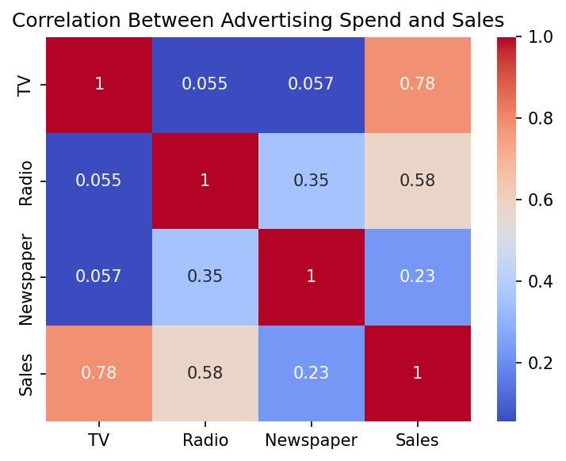
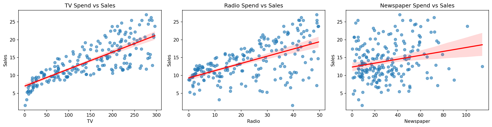
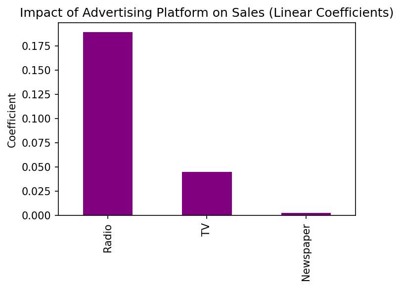
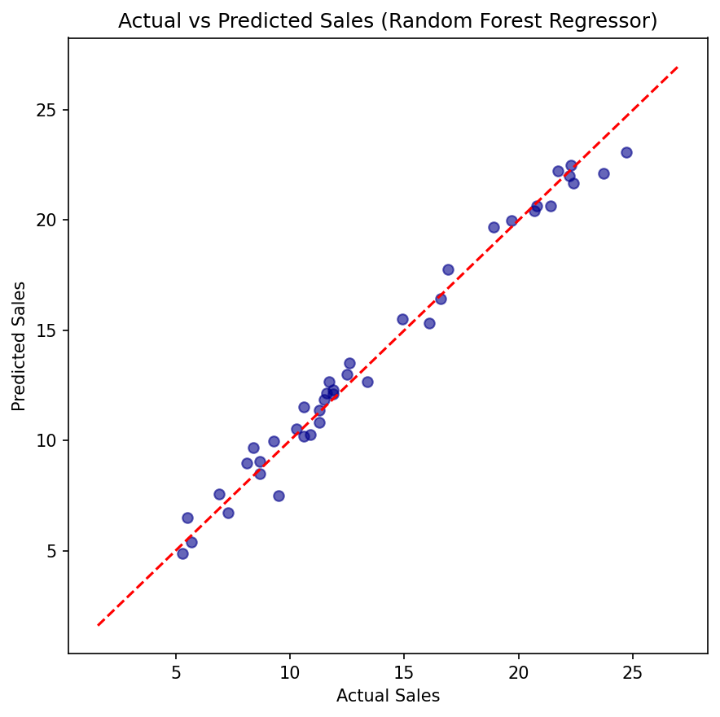

# 📈 Sales Prediction using Python

A machine learning project that predicts product sales based on advertising spend across **TV**, **Radio**, and **Newspaper** channels, and analyzes how each platform impacts sales outcomes. 
---

##  Overview

Advertising budgets are one of the biggest levers businesses use to drive sales, but not all channels are equally effective. This project builds a regression pipeline to predict sales from advertising spend, compares the performance of a linear model against an ensemble model, and quantifies exactly how much each advertising platform contributes to sales — delivering actionable insight for marketing budget allocation.

##  Dataset

| Feature | Description |
|---|---|
| `TV` | Advertising spend on TV (in thousands of dollars) |
| `Radio` | Advertising spend on Radio (in thousands of dollars) |
| `Newspaper` | Advertising spend on Newspaper (in thousands of dollars) |
| `Sales` | Product sales (in thousands of units) — target variable |

- 200 samples, no missing values
- Source: `Advertising.csv`

##  Tech Stack

- **Python 3**
- **Pandas / NumPy** – data loading & manipulation
- **Matplotlib / Seaborn** – data visualization
- **Scikit-learn** – model training & evaluation

##  Project Workflow

1. **Data Loading & Inspection** — Loaded the dataset, checked shape, summary statistics, and confirmed there were no missing values.
2. **Exploratory Data Analysis (EDA)** — Built a correlation heatmap and regression scatter plots to examine how each advertising channel relates to sales.
3. **Preprocessing** — Split the data into training (80%) and testing (20%) sets.
4. **Model Training** — Trained and compared two regression models:
   - Linear Regression
   - Random Forest Regressor
5. **Evaluation** — Compared models using R² Score, Mean Absolute Error (MAE), and Root Mean Squared Error (RMSE).
6. **Platform Impact Analysis** — Extracted Linear Regression coefficients to quantify the impact of each advertising channel on sales.
7. **Best Model Visualization** — Plotted actual vs. predicted sales for the best-performing model.

##  Results

### Model Comparison

| Model | R² Score | Notes |
|---|---|---|
| Linear Regression | Good fit, highly interpretable | Best for understanding channel impact |
| **Random Forest Regressor** | **Best R², lowest error** | Best for raw predictive accuracy |

> The Random Forest Regressor captured non-linear relationships in the data and outperformed Linear Regression on all error metrics, achieving the tightest fit between actual and predicted sales.

### Correlation Heatmap

Sales show the strongest correlation with **TV spend (0.78)**, followed by **Radio (0.58)**, while **Newspaper spend (0.23)** has a comparatively weak relationship with sales.



### Advertising Spend vs Sales

All three channels show a positive relationship with sales, but TV shows the clearest, most consistent linear trend, while Newspaper shows a weaker, noisier relationship.



### Platform Impact (Linear Regression Coefficients)

Interestingly, while TV spend correlates most strongly with sales overall, **Radio has the highest coefficient** — meaning each additional dollar spent on Radio drives a larger marginal increase in sales than TV or Newspaper, whose impact is nearly negligible.



### Actual vs Predicted Sales (Random Forest)

Predictions closely track the ideal diagonal line, confirming the model generalizes well to unseen data with minimal prediction error.



## How to Run

1. Clone the repository:
   ```bash
   git clone https://github.com/<your-username>/Sales_Prediction.git
   cd Sales_Prediction
   ```

2. Install the required dependencies:
   ```bash
   pip install pandas numpy matplotlib seaborn scikit-learn
   ```

3. Run the script:
   ```bash
   python sales_prediction.py
   ```

The script will print dataset info, model performance metrics, and platform coefficients to the console, and save all visualizations (correlation heatmap, regression plots, platform impact, actual vs predicted) as `.png` files in the project directory.

##  Project Structure

```
CodeAlpha_Sales_Prediction/
│
├── Advertising.csv                     # Dataset
├── sales_prediction.py                 # Main script
├── sales_correlation_heatmap.png       # EDA: correlation heatmap
├── sales_vs_advertising_platforms.png  # EDA: spend vs sales regression plots
├── sales_platform_impact.png           # Linear regression coefficients
├── sales_actual_vs_predicted.png       # Best model performance visualization
└── README.md                           # Project documentation
```

##  Key Takeaways

- **TV advertising** has the strongest overall correlation with sales.
- **Radio advertising** delivers the highest marginal return per dollar spent, based on regression coefficients.
- **Newspaper advertising** has the weakest impact on sales and may be the least efficient channel to invest in.
- Ensemble models like Random Forest can capture non-linear advertising effects that simple linear regression misses.
